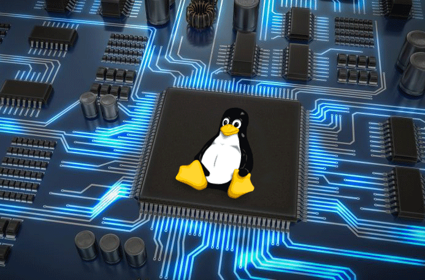

# Awesome Embedded Linux 

> A curated list of awesome Embedded Linux resources.

Embedded Linux: Operating systems based on the Linux kernel used in embedded systems such as consumer electronics, in-vehicle infotainment, networking equipment, machine control, industrial automation, navigation equipment, mobile devices, medical instruments, etc.

## Contents

- [Build systems](#build-systems)
- [Distributions](#distributions)
- [Hypervisors](#hypervisors)
- [Init systems](#init-systems)
- [Kernel patches](#kernel-patches)
- [Kernel modules](#kernel-modules)
- [OTA software updates](#ota-software-updates)
- [Platforms](#platforms)
- [Process control systems](#process-control-systems)
- [Web servers](#web-servers)
- [Books](#books)
- [Presentations](#presentations)

## Build systems

- [buildroot](https://www.buildroot.org/).
- [Debos](https://github.com/go-debos/debos) - Debian OS builder.
- [ELBE](https://elbe-rfs.org/) - Debian based E.mbedded L.inux B.uild E.nvironment.
- [Isar](https://github.com/ilbers/isar) - Integration System for Automated Root filesystem generation (Debian).
- [LFS](http://www.linuxfromscratch.org/) - Linux system from source code.
- [LTIB](http://savannah.nongnu.org/projects/ltib) - Unmaintained?.
- [mkroot](https://github.com/landley/mkroot).
- [NARD](http://www.arbetsmyra.dyndns.org/nard/) - Specific to Raspberry Pi (compute modules).
- [OpenADK](https://www.openadk.org/).
- [OpenBricks](https://github.com/OpenBricks/openbricks).
- [OpenEmbedded](http://www.openembedded.org/wiki/Main_Page) - Build system used in the [Yocto Project](https://www.yoctoproject.org/).
- [OpenWrt](https://openwrt.org/).
- [PTXdist](https://www.ptxdist.org).

## Distributions

- [Aboriginal Linux](http://landley.net/aboriginal/) - DISCONTINUED.
- [Android](https://www.android.com/versions/pie-9-0/).
- [Android (Go edition)](https://www.android.com/versions/go-edition/).
- [Ångström](http://www.angstrom-distribution.org/).
- [Arch Linux ARM](https://archlinuxarm.org/).
- [Clear Linux OS](https://clearlinux.org/) - Open source, rolling release Linux distribution optimized for performance and security, from the Cloud to the Edge, designed for customization, and manageability.
- [ELinOS](https://www.sysgo.com/products/elinos-embedded-linux).
- [Embdebian](http://www.emdebian.org/) - Embedded Debian, DISCONTINUED.
- [Embedded Gentoo](https://wiki.gentoo.org/wiki/Project:Embedded).
- [LinRT](https://www.linrt.com/wiki/linrt-bsp-wiki/) - Embedded Linux distribution that uses the FSL Community Yocto Project layers with LinRT proprietary layers for Phytec’s SOMs and Single Board Computers.
- [Moxa Industrial Linux](https://www.moxa.com/en/spotlight/industrial-computing/arm-linux-iiot-edge-gateway-portal/linux)
- [OpenSTLinux](https://www.st.com/en/embedded-software/stm32-mpu-openstlinux-distribution.html) - Yocto Project based Linux Distribution for STM32 multi-core microprocessors (MPU).
- [Sailfish OS](https://sailfishos.org/).
- [SnapGear Embedded Linux](http://www.snapgear.org/).
- [STLinux](https://www.st.com/en/development-tools/stlinux.html) - Linux for STMicroelectronics ARM or ST40 embedded processors.
- [Ubuntu Core](https://www.ubuntu.com/core).
- [Wind River Linux](https://www.windriver.com/products/linux/).

## Hypervisors

- [Cross-OS](https://www.mapusoft.com/cross-os-hypervisor/) - Hypervisor used in the military domain.
- [Crudible](https://starlab.io/crucible-product/) - Hypervisor for defense systems.
- [Jailhouse](https://github.com/siemens/jailhouse) - Linux-based partitioning hypervisor.
- [L4Re Runtime Environment](https://l4re.org/) - Operating system framework built on top of the Fiasco microkernel and providing user-level infrastructure that includes services (program loading, memory management, virtual machine management, etc.).

## Init systems

- [finit](http://troglobit.com/projects/finit/) - Fast init for Linux systems.
- [minit](http://www.fefe.de/minit/) - A small yet feature-complete init.
- [OpenRC](https://github.com/OpenRC/openrc) - Dependency-based init system that works with the system-provided init program.
- [runit](http://smarden.org/runit/) - A UNIX init scheme with service supervision.
- [systemd](https://github.com/systemd/systemd) - The systemd System and Service Manager.
- [upstart](http://upstart.ubuntu.com/) - Event-based init system.

## Kernel patches

- [PREEMPT_RT patch](https://rt.wiki.kernel.org/index.php/Main_Page) - "Controlling a laser with Linux is crazy, but everyone in this room is crazy in his own way. So if you want to use Linux to control an industrial welding laser, I have no problem with you using PREEMPT_RT." -- Linus Torvalds.

## Kernel modules

- [AppArmor](https://www.kernel.org/doc/html/v4.15/admin-guide/LSM/apparmor.html) - Linux Security Module that provides MAC style security extension for the Linux kernel.
- [LoadPin](https://www.kernel.org/doc/html/v4.15/admin-guide/LSM/LoadPin.html) - Linux Security Module that ensures all kernel-loaded files (modules, firmware, etc) all originate from the same filesystem, with the expectation that such a filesystem is backed by a read-only device.
- [SELinux](https://www.kernel.org/doc/html/v4.15/admin-guide/LSM/SELinux.html) - Linux Security Module.
- [SMACK](https://www.kernel.org/doc/html/v4.15/admin-guide/LSM/Smack.html) - Linux Security Module providing mandatory access control that includes simplicity in its primary design goals.
- [TOMOYO](https://www.kernel.org/doc/html/v4.15/admin-guide/LSM/tomoyo.html) - Linux Security Module adding name-based MAC to the Linux kernel.
- [Yama](https://www.kernel.org/doc/html/v4.15/admin-guide/LSM/Yama.html) - Linux Security Module that collects system-wide DAC security protections that are not handled by the core kernel itself.

## OTA software updates

- [HERE OTA Connect](https://www.here.com/products/automotive/ota-technology) - Over-the-air software updates for the automotive industry.
- [Mender](https://mender.io/) - Open source client-server update manager.

## Platforms

- [Balena](https://www.balena.io/)
  - [BalenaOS](https://www.balena.io/os/) - Operating System tailored for containers, designed for reliability, proven in production.
  - [OpenBalena](https://www.balena.io/open/) - Platform to deploy and manage connected devices.
  - [BalenaCloud](https://www.balena.io/cloud/) - Container-based platform for deploying IoT applications.
- [RZ/G Linux Platform](https://www.renesas.com/eu/en/products/rzg-linux-platform.html)
- [Linux microPlatform](https://foundries.io/products/#linux) - A minimal Linux distribution built using OpenEmbedded/Yocto providing OTA software updates and a container-based application runtime.
- [Torizon](https://labs.toradex.com/projects/torizon) - Linux-based software platform providing a preconfigured Yocto-based Linux distribution, bootloader, OTA service and Docker container runtime.

## Process control systems

- [daemontools](http://cr.yp.to/daemontools.html) - Collection of tools for managing services.
- [M/Monit](https://mmonit.com/) - Can monitor and manage distributed computer systems (including their processes), conduct automatic maintenance and repair and execute meaningful causal actions in error situations.
- [s6](https://skarnet.org/software/s6/) - Suite of programs to allow process supervision (a.k.a service supervision).
- [Supervisor](http://supervisord.org/) - A client/server system that allows its users to monitor and control a number of processes.
- [watchdogd](https://github.com/troglobit/watchdogd) - Advanced System & Process Supervisor for (embedded) Linux.

## Web servers

- [Apache](http://httpd.apache.org/) - httpd.
- [Barracuda](https://realtimelogic.com/products/barracuda-web-server/) - Optimized for deeply embedded devices in remote-monitoring and control-management applications.
- [Cherokee](http://cherokee-project.com/) - .
- [Hiawatha](https://www.hiawatha-webserver.org/) - An advanced and secure webserver for Unix.
- [lighttpd](https://www.lighttpd.net/) - Designed and optimized for high performance environments and for every server that is suffering load problems.
- [Monkey](http://monkey-project.com/) - Monkey is a lightweight and scalable Web Server with a strong focus on Embedded devices.
- [nginx](http://nginx.org/) - Web server and reverse proxy server with a strong focus on high concurrency, performance and low memory usage.
- [nostromo](http://www.nazgul.ch/dev_nostromo.html) - nhttpd is a simple, fast and secure HTTP server.
- [sthttpd](https://github.com/blueness/sthttpd) - A simple, small, portable, fast, and secure HTTP server.

## Books

### System design

- [Building Embedded Linux Systems](https://elinux.org/Building_Embedded_Linux_Systems) - [Book website](https://www.oreilly.com/library/view/building-embedded-linux/9780596529680/).
- [Embedded Linux Primer](https://elinux.org/Embedded_Linux_Primer) - [Book website](http://www.embeddedlinuxprimer.com/).
- [Embedded Linux System Design and Development](https://elinux.org/Embedded_Linux_System_Design_and_Development) - [Book website](https://www.crcpress.com/Embedded-Linux-System-Design-and-Development/Raghavan-Lad-Neelakandan/p/book/9780849340581).
- [Linux for Embedded and Real-time Applications](https://www.elsevier.com/books/linux-for-embedded-and-real-time-applications/abbott/978-0-12-811277-9).
- [Pro Linux Embedded Systems](https://www.springer.com/de/book/9781430272274).

### System programming

- [Advanced Programming in the UNIX Environment](http://www.apuebook.com)
- [The Linux Programming Interface](https://elinux.org/The_Linux_Programming_Interface_-_by_Michael_Kerrisk) - [Book website](https://nostarch.com/tlpi), [free only version](http://man7.org/tlpi/).
- [Linux System Programming](https://www.oreilly.com/library/view/linux-system-programming/9781449341527/).
- [Linux Debugging and Performance Tuning: Tips and Tricks](https://elinux.org/Linux_Debugging_and_Performance_Tuning).

### Kernel development

- [Mastering Linux Kernel Development: A kernel developer's reference manual](https://www.packtpub.com/application-development/mastering-linux-kernel-development)

### Device driver development

- [Essential Linux Device Drivers](https://elinux.org/Essential_Linux_Device_Drivers) - [book website](https://www.elinuxdd.com/).
- [Linux Device Drivers](https://elinux.org/Linux_Device_Drivers) - [book website](http://shop.oreilly.com/product/9780596005900.do), [free only version](https://lwn.net/Kernel/LDD3/).
- [Linux Device Drivers Development: Develop customized drivers for embedded Linux](https://www.packtpub.com/networking-and-servers/linux-device-drivers-development).

## Presentations

- Embedded Linux Conference + OpenIoT Summit Europe 2018 [slides](https://events.linuxfoundation.org/events/elc-openiot-europe-2018/program/slides/) / [video playlist](https://www.youtube.com/playlist?list=PLbzoR-pLrL6qThA7SAbhVfuMbjZsJX1CY)
- Embedded Linux Conference + OpenIoT Summit North America 2018 [video playlist](https://www.youtube.com/watch?v=wirx1SwMlbA&list=PLbzoR-pLrL6qAnHzPdrTxwCUWPja5KnOq)
- Embedded Linux Conference + OpenIoT Summit Europe 2017 [video playlist](https://www.youtube.com/playlist?list=PLbzoR-pLrL6pISWAq-1cXP4_UZAyRtesk)
- Embedded Linux Conference + OpenIoT Summit North America 2017 [video playlist](https://www.youtube.com/playlist?list=PLbzoR-pLrL6pSlkQDW7RpnNLuxPq6WVUR)
- Embedded Linux Conference + OpenIoT Summit Europe 2016 [video playlist](https://www.youtube.com/playlist?list=PLbzoR-pLrL6pRFP6SOywVJWdEHlmQE51q)
- Embedded Linux Conference Europe 2015 [video playlist](https://www.youtube.com/playlist?list=PLGeM09tlguZTP9-9nMQNGiT_2PPFay0Cs)
- Embedded Linux Conference North America 2015 [video playlist](https://www.youtube.com/playlist?list=PLGeM09tlguZTPUxEvsQiDgX0XDjfOL6oR)
- Embedded Linux Conference Europe 2014 [slides](https://elinux.org/ELC_Europe_2014_Presentations)
- Embedded Linux Conference North America 2014 video playlist [slides](https://elinux.org/ELC_2014_Presentations) / [video playlist](https://www.youtube.com/playlist?list=PL_xRWvMmKDbLAOMqMDovw-4F9fEYmf15s)
- Embedded Linux Conference Europe 2013 [slides](https://elinux.org/ELC_Europe_2013_Presentations) / [video playlist](https://www.youtube.com/playlist?list=PLbzoR-pLrL6oxnDyb7IvnNOOBur7z_8tE)
- Embedded Linux Conference North America 2013 [video playlist](https://www.youtube.com/playlist?list=PLbzoR-pLrL6reuY8eZ9S1PRofvdp9O16w)
- Embedded Linux Conference Europe 2012 [slides](https://elinux.org/ELC_Europe_2012_Presentations)
- Embedded Linux Conference North America 2012 [slides](https://elinux.org/ELC_2012_Presentations)
- Embedded Linux Conference Europe 2011 [slides](https://elinux.org/ELC_Europe_2011_Presentations)
- Embedded Linux Conference North America 2011 [slides](https://elinux.org/ELC_2011_Presentations)
- Embedded Linux Conference Europe 2010 [slides](https://elinux.org/ELC_Europe_2010_Presentations)
- Embedded Linux Conference North America 2010 [slides](https://elinux.org/ELC_2010_Presentations)
- Embedded Linux Conference Europe 2009 [slides](https://elinux.org/ELC_Europe_2009_Presentations)
- Embedded Linux Conference North America 2009 [slides](https://elinux.org/ELC_2009_Presentations)
- Embedded Linux Conference Europe 2008 [slides](https://elinux.org/ELC_Europe_2008_Presentations)
- Embedded Linux Conference North America 2008 [slides](https://elinux.org/ELC_2008_Presentations)
- Embedded Linux Conference Europe 2007 [slides](https://elinux.org/ELC_Europe_2007_Presentations)
- Embedded Linux Conference North America 2007 [slides](https://elinux.org/ELC_2007_Presentations)
- Embedded Linux Conference 2006 [slides](https://elinux.org/ELC_2006_Presentations)

## License

